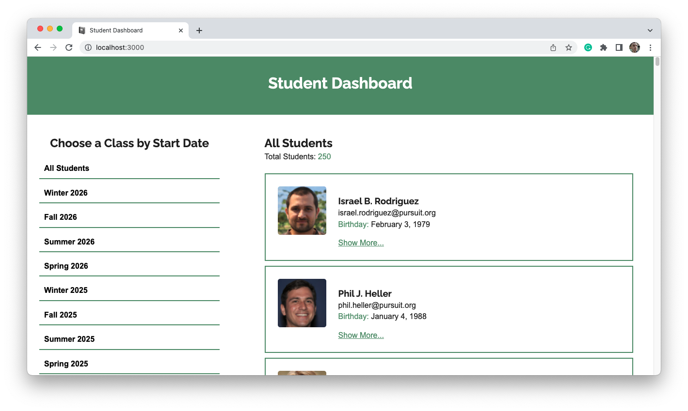
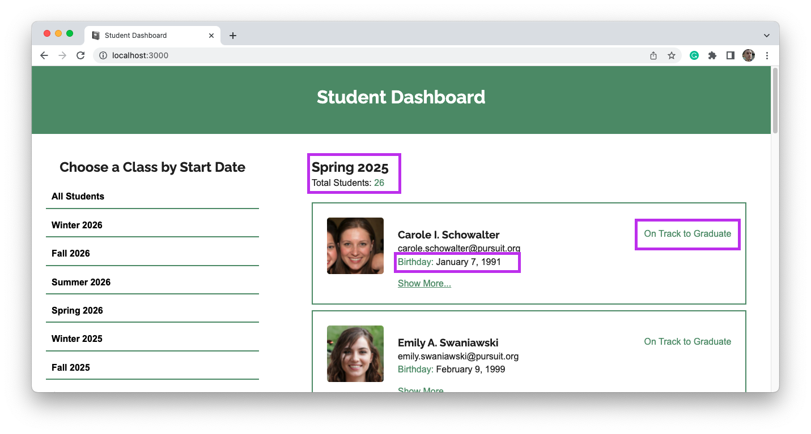
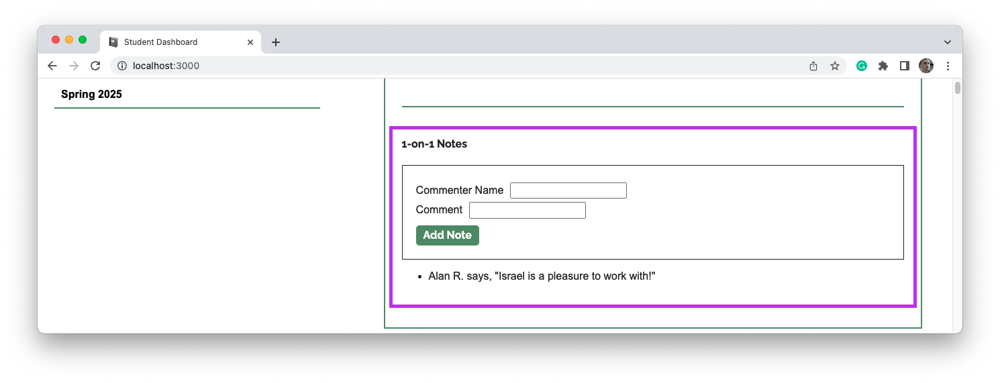

# Student Dashboard Project

For this assignment, you will build a student dashboard that will make use of already existing data stored in a JSON file. Users will be able to view students in several ways as well as add comments to those students.

## Project scoring

This project has three different parts on which you will be graded. Each part is weighted differently.

- 70% of the project is scored on **completion**.
- 20% of the project is scored through the **mastery rubric**.
- 10% of the project is scored through **stretch goals**.

In total, you must receive at least 70% to complete this project. For example, you could attain 55% of points through the completion requirements, 10% of points through the mastery rubric, and 5% of points through the stretch goals.

### Completion

To complete this project, you will need to build a React application that meets the following feature and technical requirements.

#### Overall requirements

1. The front-end application should be successfully deployed to the web.
1. Your front-end repository should have a `readme.md` file with setup instructions for your application. It should also include a link to your deployed application.

#### Front-end feature requirements

To complete the front-end application, you will need to build a React application that demonstrates the following features.

3. **Student list.** The Home page should show a list of all students. Each student should be shown including their name, username (i.e., email), birthday, and profile photo.
1. **On-track status.** Each student should also be marked as either "On Track" or "Off Track." A student is "On Track" if the following is true about them:
   - The student has a resume certification (e.g. `certifications.resume` is `true`).
   - The student has a LinkedIn certification (e.g. `certifications.linkedin` is `true`).
   - The student has a GitHub certification (e.g. `certifications.github` is `true`).
   - The student has a mock interview certification (e.g. `certifications.mockInterview` is `true`).
   - The student has a current CodeWars score that is over 600.
1. **Additional student details.** Include a link or button on each student's profile that hides and shows additional information when clicked. This feature should include the following:
   - The text of the button changes depending on whether it is open or closed.
   - Opening the details section for one student does not open it for every other student.
   - The details section includes the percentages for all scores, properly formatted as percentages.
   - The details section includes whether or not the student has received certain certifications. Instead of showing "true" or "false" for certifications, show an emoji or icon depending on the certification status.
1. **1-on-1 section.** Create a section in the student details section that contains information about a student's 1-on-1 with an instructor. To complete this feature, the following should be true:
   - The section should include a title. (e.g. "1-on-1 Notes".)
   - The section should include a form with commenter name, comment, and a submit button.
   - The section should show a list of all previous notes that have been added.
1. **Interactive 1-on-1 section.** Improve the 1-on-1 section with a working form. To complete this feature, the following should be true:
   - The form can be filled out and submitted. On submit, the inputs are cleared.
   - The submitted information is immediately shown in the list of notes.
   - While the notes will not persist if the page is loaded, the new notes _should_ be found if you interact with a new cohort in the cohort list and then find the student.
1. **Student list count.** The Home page should also include a count of how many students are within the data set.
1. **Unique list of cohorts.** The Home page should also include a unique list of cohorts on the page.
1. **Human-readable cohort names.** The list of cohorts should be human-readable (e.g. "Winter 2026" instead of "Winter2026") and ordered by time.
1. **Clickable cohorts.** When one of the cohorts is clicked from the cohort list, the students shown on the page should change so that only those students in the cohort are shown.
1. **Cohort title change.** When one of the cohorts is clicked from the cohort list, a heading on the page should change to display what cohort is being shown. The student count should update to reflect this change.

### Mastery rubric

This section of the project is designed to measure your increasing skill at writing good code and following best practices.

To view components of the mastery rubric, view the appropriate assignment on Canvas.

### Stretch goals

This section of the project measures your ability to go above and beyond in creating your project. To score points in this section, you should incorporate a feature, technology, or skill not explicitly required by the project instructions.

When you submit your pull request, _make sure to include a description of any stretch goals you implemented._ You may choose from the list below or come up with features or tasks that are more relevant to your specific implementation of the project.

- Include a count for the number of notes added to each student, which is updated when a new note is added.
- Allow for the user to click a button and the view of students changes to be just a list of names, or just a grid of profile images.
- Implement a "dark mode" version of the website, which changes the CSS on click.
- Add color-coding or segmentation to the cohort list, so that each year is visually distinct from one another.

Points will be allocated in this section at the discretion of the instructor.

## Existing code

This project includes some existing code that will help you complete the features below.

- [`src/data/data.json`](./src/data/data.json): This contains data for over 200 students. Each student has multiple properties associated with them. Some important ones include:
  - `id`: A unique ID associated with each student.
  - `profilePhoto`: A randomly generated photo from [Random users](https://xsgames.co/randomusers/).
  - `cohort`: An object represents which "cohort" the student is in.

## Advice

When building a project, there are additional skills to be gained alongside the tech you are learning. In this project, your ability to do the following will be tested:

- To plan out your approach to large project before coding
- To break large features into small, testable tasks that you can build
- To synthesize multiple skills you've learned at once
- To learn new skills and syntax on your own
- To manage your time and stay focused on the important tasks
- To ask for help

Without a good strategy, React can be very difficult. Consider reading the following before getting started:

- [ReactJS: Thinking in React](https://reactjs.org/docs/thinking-in-react.html)

### Suggested process

Consider the following process as a baseline for working through this project:

1. Start by sketching out the application on a piece of paper or online. Think about what the component hierarchy will be before you just start building.
1. Build a static, non-interactive, and non-styled version of the application first. For example, start by listing all of the student names on the page.
1. Once you have information displayed on the page, pick one component to work on to make more interactive.

Continue to slowly iterate, making small changes to complete each feature. Commit often, so that you can always undo your changes if you break something big.

## Example

The following is an example of the application. These images show the application completed at different stages of the project and highlights different parts of the project to make it clear what is being discussed.

### Landing page

### Cohort list

### Cohort list on click

### Student list with "On-track"

### Student details section

### 1-on-1 section

